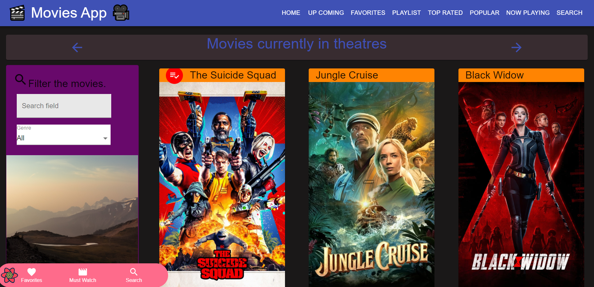
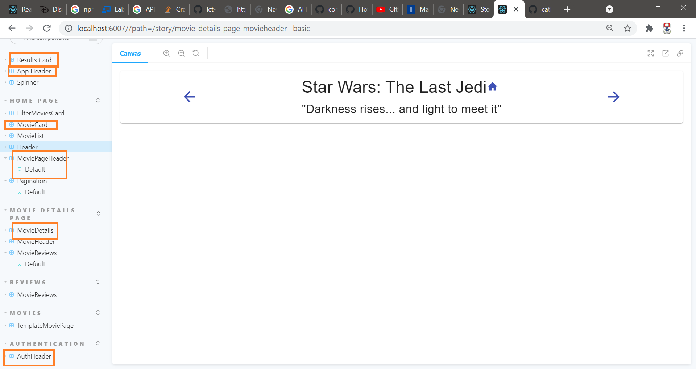
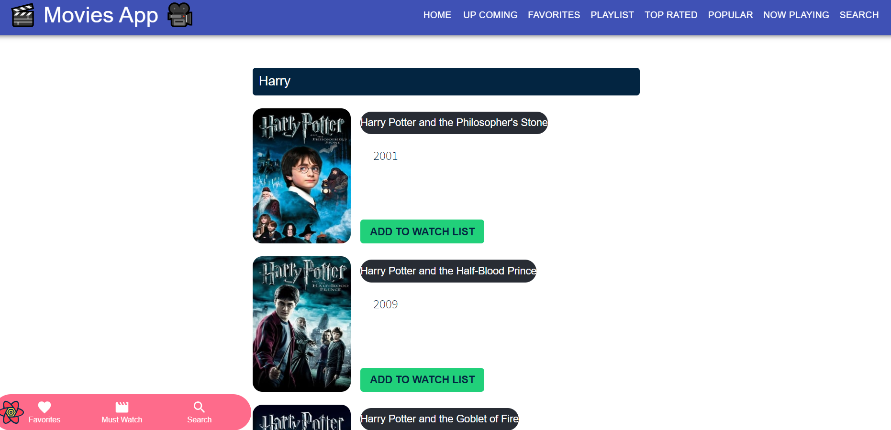

# Assignment - ReactJS app.

Name: James Geraghty
Student Number : 20022946 

## Setup requirements.
+ Delete the node_modules folder.
+ Delete the package-lock.json file
+ Run npm install --legacy-peer-deps       (from the base folder)
+ Run npm run storybook

## Overview.
This is an extension of the movies fan app. The app allows the user to view popular and upcomign movies as well as add movies to a playlist and view information about each movie on the movies's homepage. As the there are hundred of movie to view, the pagination featrie allows the user to quickly navigate through each page.
.

## New Features Added
 
 + Adding Movies to a Playlist
 + Floating Navigation Bar 
 + Pagination
 + View Up Coming Movies 
 + View Similar Movies to the Movies listed 


## API Data Model.

---Insert Image here ---

*Shows the relationship between the app, API calls and how the information is linked and represented to the user.*

The app has been developed using [The Movie Database API](https://developers.themoviedb.org/3/getting-started/introduction).

Additional Endpoints Used :

### 1. GET /movie/top_rated - Returns the top rated movies 

  `https://api.themoviedb.org/3/movie/top_rated?api_key=${process.env.REACT_APP_TMDB_KEY}&language=en-US&page=1`
  
  *Returned JSON example*:
 ```
{
page: 1,
results: [
{
adult: false,
backdrop_path: "/gNBCvtYyGPbjPCT1k3MvJuNuXR6.jpg",
genre_ids: [
35,
18,
10749
],
id: 19404,
original_language: "hi",
original_title: "दिलवाले दुल्हनिया ले जायेंगे",
overview: "Raj is a rich, carefree, happy-go-lucky second generation NRI. Simran is the daughter of Chaudhary Baldev Singh, who in spite of being an NRI is very strict about adherence to Indian values. Simran has left for India to be married to her childhood fiancé. Raj leaves for India with a mission at his hands, to claim his lady love under the noses of her whole family. Thus begins a saga.",
popularity: 20.108,
poster_path: "/2CAL2433ZeIihfX1Hb2139CX0pW.jpg",
release_date: "1995-10-20",
title: "Dilwale Dulhania Le Jayenge",
video: false,
vote_average: 8.7,
vote_count: 3086
},
{
adult: false,
backdrop_path: "/iNh3BivHyg5sQRPP1KOkzguEX0H.jpg",
genre_ids: [
18,
80
],
id: 278,
original_language: "en",
original_title: "The Shawshank Redemption",
overview: "Framed in the 1940s for the double murder of his wife and her lover, upstanding banker Andy Dufresne begins a new life at the Shawshank prison, where he puts his accounting skills to work for an amoral warden. During his long stretch in prison, Dufresne comes to be admired by the other inmates -- including an older prisoner named Red -- for his integrity and unquenchable sense of hope.",
popularity: 55.779,
poster_path: "/q6y0Go1tsGEsmtFryDOJo3dEmqu.jpg",
release_date: "1994-09-23",
title: "The Shawshank Redemption",
video: false,
vote_average: 8.7,
vote_count: 19449
},
{
adult: false,
backdrop_path: "/rSPw7tgCH9c6NqICZef4kZjFOQ5.jpg",
genre_ids: [
18,
80
],
 ```
 
 
 
 ### 2. GET /movie/19404/similar - Returns similar movies to the movie (19404) on the page. 

  `https://api.themoviedb.org/3/movie/top_rated?api_key=${process.env.REACT_APP_TMDB_KEY}&language=en-US&page=1`
  
  *Returned JSON example*:
 ```
 {
page: 1,
results: [
{
adult: false,
backdrop_path: "/alWtP7JwoanQyqXzg3PCbEFrfwS.jpg",
genre_ids: [
53,
18,
80,
27
],
id: 1359,
title: "American Psycho",
original_language: "en",
original_title: "American Psycho",
overview: "A wealthy New York investment banking executive hides his alternate psychopathic ego from his co-workers and friends as he escalates deeper into his illogical, gratuitous fantasies.",
popularity: 23.449,
poster_path: "/3ddHhfMlZHZCefHDeaP8FzSoH4Y.jpg",
release_date: "2000-04-13",
video: false,
vote_average: 7.346,
vote_count: 6888
},
{
adult: false,
backdrop_path: "/s04Ds4xbJU7DzeGVyamccH4LoxF.jpg",
genre_ids: [
18,
10749
],
id: 1360,
title: "Frida",
original_language: "en",
original_title: "Frida",
overview: "A biography of artist Frida Kahlo, who channeled the pain of a crippling injury and her tempestuous marriage into her work.",
popularity: 16.346,
poster_path: "/a4hgR6aKoohB6MHni171jbi9BkU.jpg",
release_date: "2002-08-29",
video: false,
vote_average: 7.484,
vote_count: 1591
},
 
 ```
 


![][model]

......[For the Movies Fan app] Specify the additional TMDB endpoints used and show sample responses, in JSON .........

## Additional TMDB endpoints used

## App Design.

### Component catalogue.

....... Insert a screenshot from the Storybook UI showing your component catalogue. [For the Movies app, hi-light stories relating to new/modified components - see the example screenshot below] .......

![][stories]

### UI Design.



*Displays all the Movies Now showing in Cinema.*


*Storybooks that have been added.*



*Search a Movies by name and returns the movie poster and the year of release.*


*Show a list of movies that are similar to the movie viewed.*


*Returns a list of Up Coming Movies.*


*pagination and Quick Search Menu Bar.*

![][view]
>Shows detailed information on a movie. Clicking the 'Reviews' floating action button will display extracts from critic reviews.

### Routing.
List of the Route supported by the app. 

        + <Route exact path="/movies/search" component={SiteSearch} />
        + <Route exact path="/movies/:id/similar" component={SimilarMoviesPage} />
        + <Route exact path="/movies/now_playing" component={NowPlayingMoviesPage} />
        + <Route exact path="/movies/popular" component={PopularMoviesPage} />
        + <PrivateRoute exact path="/movies/playlist" component={PLayListPage} /> - Private Route for Playlist
        + <Route exact path="/movies/toprated" component={TopRatedMoviesPage} />
        + <Route exact path="/reviews/form" component={AddMovieReviewPage} />
        + <Route exact path="/movies/upcoming" component={UpcomingMoviesPage} />
        + <Route path="/reviews/:id" component={MovieReviewPage} />
        + <Route exact path="/movies/favorites" component={FavoriteMoviesPage} />
        + <Route exact path="/reviews/form" component={WriteReviewPage} />
        + <Route path="/movies/:id" component={MoviePage} />          
        + <PrivateRoute exact path="/" component={HomePage} />  - Provate Route for Homepage Login 
        + <Route path="/login" component={LoginPage} />   
        + <Redirect from="*" to="/" />

## Independent learning (If relevant).

....... Briefly state any technologies/techniques used in your project codebase that was not covered in the lectures/labs. Provide source code filename (source code excerpts are not required in most cases) references to support your assertions and include references (articles/blogs) ......... 


[model]: ./data.jpg
[view]: ./view.png
[stories]: ./storybook.png
